<div align="center">


# 🕸️ ASTra MCP

### **Permanent Code Memory for AI Coding Assistants**

*Stop burning tokens. Start saving thousands.*

<br/>


[Quickstart](#-quickstart) · [Live Demo](#-live-demo) · [How It Works](#-how-it-works) · [Use Cases](#-what-questions-astra-can-answer) · [Install](#-installation) · [FAQ](#-frequently-asked-questions)

</div>

---

<table>
<tr>
<td width="50%" valign="top">

### 🔥 The Problem

Your AI assistant **reads entire files** to understand your codebase. On a 100k-line repo, that's **500k+ tokens per session**.

- ⏱️ Slow responses
- 💸 Burns API credits
- 🚫 Hits context limits
- 🎯 Misses connections between files

</td>
<td width="50%" valign="top">

### ⚡ The Fix

ASTra builds a **permanent knowledge graph** of your codebase. Before every AI task, it injects **only the 5 most relevant functions** — not 50 whole files.

- 🚀 Instant context
- 💰 Slashes API spend ~99%
- ♾️ Never hits context limits
- 🧠 Sees the whole system

</td>
</tr>
</table>

---

## 📊 Real Numbers from Real Projects

<div align="center">

<table>
<thead>
<tr>
<th>Metric</th>
<th>❌ Without ASTra</th>
<th>✅ With ASTra</th>
<th>📉 Saved</th>
</tr>
</thead>
<tbody>
<tr>
<td><b>Tokens per coding task</b></td>
<td><code>~112,000</code></td>
<td><code>~1,250</code></td>
<td><b style="color:#5eead4">98.9%</b></td>
</tr>
<tr>
<td><b>Cost per task</b> (Claude Sonnet)</td>
<td><code>$0.34</code></td>
<td><code>$0.004</code></td>
<td><b>$0.336</b></td>
</tr>
<tr>
<td><b>Time to context</b></td>
<td><code>12–18 s</code></td>
<td><code>&lt; 1 s</code></td>
<td><b>15× faster</b></td>
</tr>
<tr>
<td><b>Files AI must read</b></td>
<td><code>20–40</code></td>
<td><code>0</code></td>
<td><b>100%</b></td>
</tr>
</tbody>
</table>

</div>

> 💡 **Translation:** A developer running 50 AI-assisted tasks per day cuts spending from **~$17/day to ~$0.20/day**. Across a 10-engineer team: roughly **$5,000+/month saved**.

---

## 🎬 Live Demo

<div align="center">

### 🔥 Watch ASTra Re-Wire Code In Real Time



<sub><i>Animation loops automatically · A function migrates between code clusters, edges re-wire live</i></sub>

<br/><br/>

### 🎮 Try the Fully Interactive Version

| | |
|---|---|
| **🖱 Drag nodes** to rearrange | **👆 Click any node** to inspect callers/callees |
| **⚡ Click "Move"** to trigger live migration | **🔀 Shake** to re-layout the graph |

<table>
<tr>
<td align="center" width="50%">

### 🌐 Open in Browser

<a href="https://charan-place.github.io/ASTra-MCP/demo.html"><b>charan-place.github.io/ASTra-MCP/demo.html ↗</b></a>

*(Live via GitHub Pages — full D3 interactivity)*

</td>
<td align="center" width="50%">

### 💻 Run Locally

```bash
git clone https://github.com/Charan-place/ASTra-MCP
open ASTra-MCP/docs/demo.html
```

*(Works offline. No backend.)*

</td>
</tr>
</table>

</div>

<br/>

<details open>
<summary><b>🖥️ Knowledge Graph Dashboard</b> — click to expand</summary>
<br/>

```
┌──────────────────────────────────────────────────────────────────┐
│  🕸  ASTra Dashboard                            localhost:7865    │
├──────────────────────────────────────────────────────────────────┤
│                                                                  │
│   ╭────────────────╮ ╭────────────────╮ ╭────────────────╮       │
│   │ Symbols        │ │ Token Savings  │ │ Cost Saved     │       │
│   │     605        │ │   1.2M tokens  │ │    $4.56       │       │
│   ╰────────────────╯ ╰────────────────╯ ╰────────────────╯       │
│                                                                  │
│   📊 LAST QUERY — "add rate limiting"                            │
│   ████████████████████████████████████  Naive: 112,271 tokens    │
│   █                                     ASTra:   1,254 tokens    │
│                                                                  │
│              ╱──────────────╲                                    │
│             ╱     98.9%      ╲          Reduction Ring          │
│            │   ▰▰▰▰▰▰▰▰▰      │                                  │
│             ╲                ╱                                   │
│              ╲──────────────╱                                    │
│                                                                  │
└──────────────────────────────────────────────────────────────────┘
```

</details>

<details open>
<summary><b>🧬 Interactive 3-Level Knowledge Graph</b></summary>
<br/>

```
LEVEL 1 — FOLDERS                LEVEL 2 — FILES INSIDE FOLDER
                                                                
    📁 core ────12 calls───►📁 strategies        ┌─────────────┐
        │                       │                │ api_client  │──┐
        │                       ▼                │ data_fetch  │  │
        ▼                   📁 execution         │ trade_exec  │◄─┘
    📁 monitoring ◄─────────────┘                └─────────────┘

           (zoom: dbl-click any folder)

LEVEL 3 — FUNCTIONS (call graph w/ direction)

    ○ _sign ───► ○ _request ───► ○ get_wallet
                       │                 ▲
                       └─────►  ○ place_order
                                         │
                                         ▼
                                ○ apply_fees
```

**Live features:**
- 🔴 **Pink pulse** = nodes ASTra picked for current query
- 🟠 **Orange** = nodes from previous query
- 🟡 **Yellow** = older query trail
- ↘️ **Edge thickness** = call frequency
- 🖱️ **Hover** = light up full caller→callee path
- 🔄 **Auto-refresh** when MCP tool fires new query

</details>

<details>
<summary><b>📈 Live Query Trace</b> — see ASTra in action</summary>
<br/>

```html
You ask Claude Code:    "Add 2FA to the login flow"
                        ↓
                    [MCP call]
                        ↓
   ┌────────────────────────────────────────────┐
   │ ASTra fires:                               │
   │                                            │
   │   1. embed("Add 2FA to login flow")        │
   │      → 384-dim vector                      │
   │                                            │
   │   2. cosine top-5 → SEEDS:                 │
   │      • login()       0.81                  │
   │      • auth_check()  0.78                  │
   │      • User.verify() 0.74                  │
   │      • session_new() 0.71                  │
   │      • hash_pw()     0.68                  │
   │                                            │
   │   3. PageRank from seeds (top 25):         │
   │      → JWT helpers, session store,         │
   │        rate limiter, error pages,          │
   │        logger, middleware...               │
   │                                            │
   │   4. Serialize → 1,254 tokens              │
   │                                            │
   │   5. Snapshot HTML written                 │
   └────────────────────────────────────────────┘
                        ↓
   Claude responds with focused 2FA code
   using ONLY the relevant 30 symbols.
```

</details>

<details>
<summary><b>🔧 Per-File Symbol Map</b> (instead of reading 500 lines)</summary>
<br/>

```python
# What ASTra returns when LLM asks "show me api_client.py"
# 78 tokens. Reading the file would be 4,200 tokens.

class CoinSwitchClient:
  def __init__(api_key, secret_key) -> None
    # Loads Ed25519 private key for HMAC signing
  def _sign(method, path, params) -> tuple[str, str]
    # Returns (signature_hex, epoch_ms)
  def place_order(symbol, side, qty, ...) -> Dict
    # Places futures order with bracket logic
  def get_futures_balance_usdt() -> float
    # Returns USDT available in futures wallet
  ...
```

</details>

---

## 🚀 Quickstart

```bash
# 1. Install
pip install astra-mcp

# 2. Index your project (one-time, ~60s)
cd ~/your-project
astra init

# 3. Add to your AI assistant
# (Claude Code auto-discovers if installed via plugin)

# 4. Open dashboard (optional but cool)
astra dashboard
# → http://localhost:7865
```

That's it. Your AI assistant now uses ASTra automatically for every coding task.

---

## 🎯 What Questions ASTra Can Answer

<table>
<tr>
<th width="30%">Category</th>
<th>Example Questions</th>
</tr>
<tr>
<td><b>🛠 Build something</b></td>
<td>
"Add 2FA to login" · "Add rate limiting" · "Refactor payment flow"
</td>
</tr>
<tr>
<td><b>🔍 Find something</b></td>
<td>
"Where do we validate webhooks?" · "Find files leaking API keys" · "Show me all strategy implementations"
</td>
</tr>
<tr>
<td><b>💥 Impact analysis</b></td>
<td>
"Who calls <code>process_order()</code>?" · "What does <code>place_bracket()</code> depend on?" · "Will renaming this break anything?"
</td>
</tr>
<tr>
<td><b>📖 Skim a file</b></td>
<td>
"Symbol map of <code>api_client.py</code>" · "What's in <code>strategies/base.py</code>?"
</td>
</tr>
<tr>
<td><b>🧠 Remember context</b></td>
<td>
"Did I solve this kind of bug before?" · "What approach did we try last week?"
</td>
</tr>
</table>

---

## 🧠 How It Works

```
┌────────────────────────────────────────────────────────────────┐
│   1. INDEX   →   tree-sitter parses every .py/.js/.ts          │
│                    ↓                                           │
│                 extract symbols (functions, classes, calls)    │
│                    ↓                                           │
│                 embed each → 384-dim vector                    │
│                    ↓                                           │
│                 store in SQLite (nodes + edges)                │
├────────────────────────────────────────────────────────────────┤
│   2. WATCH   →   filesystem watcher → incremental re-index     │
├────────────────────────────────────────────────────────────────┤
│   3. QUERY   →   task text → embedding → top-5 seeds           │
│                    ↓                                           │
│                 Personalized PageRank → expand to top-25       │
│                    ↓                                           │
│                 serialize signatures only → fit token budget   │
│                    ↓                                           │
│                 inject into AI assistant via MCP               │
└────────────────────────────────────────────────────────────────┘
```

**Stack:**
- 🌳 **tree-sitter** — AST parsing (Python, JS, TS, JSX, TSX)
- 🤖 **sentence-transformers** — local embeddings (`all-MiniLM-L6-v2`, 384-dim)
- 🕸 **NetworkX** — Personalized PageRank over call graph
- 💾 **SQLite** — knowledge graph storage
- 🛰 **MCP protocol** — stdio interface for AI assistants
- 🌐 **FastAPI + D3.js** — real-time dashboard

---

## 📥 Installation

### Option 1 — Claude Code Plugin (Recommended)

<details>
<summary>Click for steps</summary>

```bash
# Inside Claude Code:
# Settings → Manage Plugins → Marketplace → search "astra" → Install
```

That's it. Plugin runs `install.sh` automatically.

</details>

### Option 2 — pip (Universal: Cursor, Codex, any MCP client)

<details>
<summary>Click for steps</summary>

```bash
pip install astra-mcp
astra init
```

Then add to your MCP client config:

```json
{
  "mcpServers": {
    "astra": {
      "command": "python3",
      "args": ["-m", "astra.mcp.server"]
    }
  }
}
```

Restart your AI assistant.

</details>

### Option 3 — From Source

<details>
<summary>Click for steps</summary>

```bash
git clone https://github.com/Charan-place/ASTra-MCP.git
cd astra-mcp
bash install.sh
```

</details>

---

## 🧰 Command Reference

| Command | Purpose |
|---|---|
| `astra init` | Index current project (first-time setup) |
| `astra reindex` | Force-rebuild index |
| `astra status` | Show index health |
| `astra search "auth code"` | Quick semantic search |
| `astra dashboard` | Launch web dashboard on `:7865` |
| `astra bench "fix login bug"` | Benchmark token savings |
| `astra watch` | File watcher (auto-runs in background) |

---

## 🔐 Privacy & Security

<table>
<tr>
<td>✅</td><td><b>Local-first</b> — Code never leaves your machine. SQLite on your disk.</td>
</tr>
<tr>
<td>✅</td><td><b>No telemetry</b> — ASTra doesn't phone home.</td>
</tr>
<tr>
<td>✅</td><td><b>No API keys</b> — Embeddings model runs locally.</td>
</tr>
<tr>
<td>✅</td><td><b>Self-hosted dashboard</b> — Runs on <code>localhost</code> only.</td>
</tr>
<tr>
<td>✅</td><td><b>Open source</b> — Apache 2.0 licensed. Audit, fork, ship.</td>
</tr>
</table>

Safe for confidential codebases (medical, financial, defense). Nothing leaves the box.

---

## 🆚 vs. The Alternatives

| Tool | Semantic? | Local? | Structural? | Auto-injects to AI? |
|---|---|---|---|---|
| **ASTra** | ✅ | ✅ | ✅ | ✅ |
| Grep / ripgrep | ❌ | ✅ | ❌ | ❌ |
| GitHub Copilot index | ✅ | ❌ (cloud) | ❌ | partial |
| Chroma / Pinecone RAG | ✅ | partial | ❌ | manual |
| tree-sitter alone | ❌ | ✅ | ✅ | ❌ |

ASTra combines **all four signals**: semantic similarity + AST structure + call graph + PageRank importance.

---

## ❓ Frequently Asked Questions

<details>
<summary><b>Will this slow down my AI assistant?</b></summary>
No. Queries take 30–100ms. You save 10+ seconds of file-reading per task.
</details>

<details>
<summary><b>Does it work on huge codebases?</b></summary>
Yes. Tested on 5,000+ file projects. Index size is roughly 1–3% of source.
</details>

<details>
<summary><b>Languages supported?</b></summary>
Python, JavaScript, TypeScript, JSX, TSX today. Go, Rust, Java planned.
</details>

<details>
<summary><b>What if my code changes constantly?</b></summary>
ASTra has a file watcher. Edit a file → index updates in &lt;100ms.
</details>

<details>
<summary><b>Does it work offline?</b></summary>
Yes, after first install (embeddings model downloads once, ~80MB).
</details>

<details>
<summary><b>Can I use it without an AI assistant?</b></summary>
Yes. CLI works standalone (<code>astra search</code>, <code>astra dashboard</code>).
</details>

<details>
<summary><b>How is this different from RAG?</b></summary>
Standard RAG embeds raw text chunks. ASTra embeds <i>parsed symbols with structural context</i>. Far higher signal density.
</details>

<details>
<summary><b>Does ASTra train on my code?</b></summary>
No. Nothing sent anywhere. Embeddings computed locally, stored in <code>.astra/graph.db</code>.
</details>

<details>
<summary><b>Can I delete the index?</b></summary>
Yes — <code>rm -rf .astra</code>. Rebuild with <code>astra init</code>.
</details>

---

## 🗺️ Roadmap

- [ ] Go, Rust, Java, C++ parsers
- [ ] VS Code extension (graph inline with editor)
- [ ] Team mode (shared index via S3/GCS)
- [ ] Hover annotations: PageRank score per symbol
- [ ] Diff-aware indexing for PR review
- [ ] Cross-repo monorepo support
- [ ] HNSW indexing for 100k+ symbol corpora

---

## 🤝 Contributing

PRs welcome. High-value areas:
- 🌐 New language parsers ([astra/indexer/parser.py](astra/indexer/parser.py))
- 🎨 Dashboard UX
- 📊 Benchmarks on diverse codebases
- 📖 Translations

---

## 📜 License

<div align="center">

**Apache License 2.0**

Copyright © 2026 **Narra Satya Sai Charan**

[](https://www.apache.org/licenses/LICENSE-2.0)

</div>

```
Licensed under the Apache License, Version 2.0 (the "License");
you may not use this file except in compliance with the License.
You may obtain a copy of the License at

    http://www.apache.org/licenses/LICENSE-2.0

Unless required by applicable law or agreed to in writing, software
distributed under the License is distributed on an "AS IS" BASIS,
WITHOUT WARRANTIES OR CONDITIONS OF ANY KIND, either express or implied.
See the License for the specific language governing permissions and
limitations under the License.
```

Full license → [LICENSE](LICENSE)

| | What Apache 2.0 grants you |
|---|---|
| ✅ | **Commercial use** — sell, embed, ship in paid products |
| ✅ | **Modify** — fork and change anything |
| ✅ | **Distribute** — share originals or modifications |
| ✅ | **Patent grant** — contributors grant you patent rights to their code |
| ✅ | **Private use** — use internally without releasing changes |
| 📌 | **Must:** include LICENSE + NOTICE, state changes you made, keep copyright notices |
| ❌ | **Cannot:** use contributor trademarks, hold authors liable, sue contributors over patents |

---

## 🙏 Credits

Built by **Narra Satya Sai Charan**.

Inspired by years of watching AI assistants burn money reading the same files over and over.

If ASTra saves you tokens, **star the repo** ⭐ — it helps others find this tool.

---

<div align="center">

**🕸 ASTra MCP** — *Code memory that thinks like an engineer.*

<sub>Made with ☕ + 🧠 + a deep grudge against context window limits.</sub>

</div>
