<div align="center">

<br/>



<br/>

# ASTra MCP — Permanent Code Memory for AI Coding Assistants

<h3>MCP server that gives Claude Code, Cursor, Codex and Windsurf structural memory of your codebase</h3>

<p><i>AST parsing · Knowledge graph · PageRank · Semantic embeddings · 100% local · 98.9% token reduction</i></p>

<br/>

[](https://ast-ra-mcp.vercel.app/demo)
[](LICENSE)
[](https://python.org)
[](https://modelcontextprotocol.io)

<br/>

[](benchmarks/)
[](#)
[](#-privacy--security)
[](#-privacy--security)
[](#-installation)

<br/>

[Quickstart](#-quickstart) · [Integrate](#-integrate-with-your-ai-assistant) · [How It Works](#-how-it-works) · [All Commands](#-command-reference) · [Architecture](ARCHITECTURE.md) · [Live Demo](https://ast-ra-mcp.vercel.app/demo)

<br/>

</div>

---

**ASTra MCP** is an open-source MCP server that builds a permanent AST knowledge graph of your codebase, so AI coding assistants like Claude Code, Cursor, and Codex get surgical context — not entire files. 98.9% fewer tokens. Zero cloud. Runs fully local.

---

<table>
<tr>
<td width="50%" valign="top">

### 🔥 The Problem

Your AI assistant **reads entire files** to understand your codebase. On a 100k-line repo that's **500k+ tokens per session**.

- ⏱️ Slow, expensive responses
- 💸 Burns API credits fast
- 🚫 Hits context window limits
- 🎯 Misses cross-file connections
- 🔁 Re-reads the same code every session

</td>
<td width="50%" valign="top">

### ⚡ The Fix

ASTra builds a **permanent knowledge graph** of your codebase. Every AI task gets only the 5–25 most relevant functions — not 50 whole files.

- 🚀 Sub-second context injection
- 💰 ~99% reduction in tokens
- ♾️ Never hits context limits
- 🧠 Understands cross-file structure
- 💾 Memory persists across sessions

</td>
</tr>
</table>

---

## 📊 Real Numbers

<div align="center">

| Metric | ❌ Without ASTra | ✅ With ASTra | Saved |
|--------|-----------------|--------------|-------|
| **Tokens per task** | `~112,000` | `~1,250` | **98.9%** |
| **Cost per task** (Claude Sonnet) | `$0.34` | `$0.004` | **$0.336** |
| **Time to context** | `12–18 s` | `< 100 ms` | **150×** |
| **Files AI must read** | `20–40` | `0` | **100%** |

</div>

> 💡 50 AI tasks/day × 10 engineers = roughly **$5,000/month saved**.

---

## 🎬 See It In Action

<div align="center">


<sub><i>A function migrates between code clusters. Edges re-wire live. Loops every 6s.</i></sub>

<br/><br/>

**[🎮 Open Interactive Demo →](https://ast-ra-mcp.vercel.app/demo)**

*Drag nodes · Click to inspect callers/callees · Watch live migration*

</div>

---

## 🚀 Quickstart

```bash
# 1. Install
pip install astra-mcp

# 2. Index your project (one-time, ~60s)
cd ~/your-project
astra init

# 3. Start live daemon (keeps graph hot in memory)
astra daemon start

# 4. Connect your AI assistant (2 min setup)
# → Claude Code:  add to ~/.claude/mcp.json  (or use Plugin)
# → Cursor:       Settings → Features → MCP Servers
# → Windsurf:     Settings → MCP
# → Continue.dev: ~/.continue/config.json
# Full per-assistant instructions: see "Integrate With Your AI Assistant" below

# 5. Optional: open the visual dashboard
astra dashboard
# → http://localhost:7865
```

That's it. Your AI assistant now has permanent structural memory of your codebase.

---

## 🧠 How It Works

```
YOUR CODEBASE
      │
      ▼
┌─────────────────────────────────────────────────────────────┐
│  PHASE 1 — INDEX  (one-time, ~60s)                          │
│                                                             │
│  tree-sitter  →  AST parse every .py / .js / .ts file      │
│       ↓                                                     │
│  Extract symbols: functions, classes, methods, imports      │
│       ↓                                                     │
│  all-MiniLM-L6-v2  →  embed each symbol → 384-dim vector   │
│       ↓                                                     │
│  SQLite  →  store nodes + edges + embeddings                │
└─────────────────────────────────────────────────────────────┘
      │
      ▼
┌─────────────────────────────────────────────────────────────┐
│  PHASE 2 — LIVE DAEMON  (background process)                │
│                                                             │
│  watchdog  →  detects file saves → re-index changed file    │
│  Unix socket  →  any tool queries the live in-memory graph  │
│  Incremental PageRank  →  updates subgraph only (10× faster)│
└─────────────────────────────────────────────────────────────┘
      │
      ▼
┌─────────────────────────────────────────────────────────────┐
│  PHASE 3 — QUERY  (per AI task, <100ms)                     │
│                                                             │
│  embed(task)  →  cosine similarity  →  top-5 seed nodes     │
│       ↓                                                     │
│  Personalized PageRank from seeds  →  expand to top-25      │
│       ↓                                                     │
│  Serialize signatures only  →  fit token budget             │
│       ↓                                                     │
│  Inject into AI assistant via MCP protocol                  │
└─────────────────────────────────────────────────────────────┘
```

**Full query trace example:**

```
You type:  "Add 2FA to the login flow"
                    ↓
           ASTra embeds → 384-dim vector
                    ↓
           Cosine top-5 seeds:
             • login()        0.81
             • auth_check()   0.78
             • User.verify()  0.74
             • session_new()  0.71
             • hash_pw()      0.68
                    ↓
           PageRank expands to 25 nodes:
             JWT helpers, session store,
             rate limiter, middleware...
                    ↓
           1,254 tokens injected  (was 112,000)
                    ↓
           Claude writes focused 2FA code
           using only the 25 relevant symbols.
```

---

## 🔬 Intelligence Layers

ASTra ships with 5 analysis engines beyond basic context retrieval:

### ⚡ Live Daemon
```bash
astra daemon start          # persistent background process
astra daemon status         # live graph stats
astra daemon query "auth"   # query hot in-memory graph (~10ms)
astra daemon stop
```
The daemon keeps the knowledge graph loaded in memory. No cold-start per query. Broadcasts graph deltas to all subscribers (dashboard auto-refreshes).

---

### 💥 Impact Analyzer
```bash
astra impact get_context get_node
# Impact Analysis
#   Changed nodes  : 2
#   Blast radius   : 278 functions affected
#   Risk score     : 91/100
#   ⚠ Untested high-risk: build_context, search_symbols, ...
```
Before you change a function, know what breaks. Reverse BFS over the call graph, weighted by PageRank. Parses `git diff` directly for pre-commit hooks.

```bash
# Wire into pre-commit
git diff HEAD | astra impact --diff --project .
```

---

### 🔍 Semantic Drift Detector
```bash
astra audit .
# Found 134 drift warnings
# dashboard   drift=0.96   calls: start, _resolve_dirs
# _migrate    drift=0.95   calls: commit, commit
# recall      drift=0.95   calls: embed_text, top_k_similar
```
Detects functions whose **name/docstring** doesn't match their **actual behavior** (what they call). `recall()` that calls `embed_text()` is doing semantic search — that's drift. Uses existing embeddings, zero new ML.

---

### 📅 Temporal Knowledge Graph
```bash
astra timeline . --max-commits 200
# Top volatile nodes:
# login        changes: 7   volatility: 0.035
# auth_check   changes: 5   volatility: 0.025
```
Replays git history through the AST parser. Builds a 4D graph (nodes + edges + time). Reveals which functions are volatile (high churn = high risk), when dependencies appeared, which files always break together.

```bash
pip install gitpython   # one-time dependency
astra timeline . --max-commits 50
```

---

### 🌐 Cross-Repo Federation
```bash
astra federate ./service-auth ./service-api ./service-payments
# Added repo: service-auth
# Added repo: service-api
# Cross-repo edges: 47 found
# validate_token   EXPORT   service-auth → service-api   conf=0.90
```
Links boundary nodes across repos: `__init__.py` exports, API endpoints, shared function names. Builds a unified graph spanning your entire microservices fleet. PageRank runs across the full federation.

---

## 🛠 Command Reference

### Core
| Command | Description |
|---------|-------------|
| `astra init [path]` | Index codebase (one-time setup, ~60s) |
| `astra init --force` | Force full re-index |
| `astra status` | Show index health: nodes, edges, files |
| `astra watch` | Start MCP server + file watcher |
| `astra query "task"` | Test context retrieval |
| `astra bench "task"` | Benchmark token savings vs naive read |
| `astra dashboard` | Launch web dashboard on `:7865` |

### Intelligence
| Command | Description |
|---------|-------------|
| `astra daemon start` | Start live background daemon |
| `astra daemon stop` | Stop daemon |
| `astra daemon status` | Show daemon stats |
| `astra daemon query "task"` | Query hot in-memory graph |
| `astra impact [fn1] [fn2]` | Blast radius analysis |
| `astra impact --diff` | Impact from `git diff` stdin |
| `astra audit` | Semantic drift scan |
| `astra audit --file path.py` | Scan one file |
| `astra timeline` | Build temporal graph from git history |
| `astra federate repo1 repo2` | Link repos into federated graph |

### MCP Tools (AI assistant calls these automatically)
| Tool | Description |
|------|-------------|
| `astra_get_context` | Main: task → minimal relevant context |
| `astra_search` | Semantic symbol search |
| `astra_get_callers` | Who calls this function |
| `astra_get_callees` | What this function calls |
| `astra_get_file_map` | Symbol signatures for a file |
| `astra_session_memory` | Recall past sessions |
| `astra_index_status` | Index health check |
| `astra_impact_analysis` | Blast radius before editing |
| `astra_semantic_audit` | Drift scan |
| `astra_get_volatility` | Temporal risk data |
| `astra_trace_cross_repo` | Follow calls across repos |

---

## 📥 Installation

### Step 1 — Install ASTra

```bash
# From PyPI
pip install astra-mcp

# Or from source
git clone https://github.com/Charan-place/ASTra-MCP.git
cd ASTra-MCP && bash install.sh
```

### Step 2 — Index your project

```bash
cd ~/your-project
astra init                  # one-time, ~60s for large repos
astra daemon start          # keep graph hot in memory
```

### Step 3 — Connect to your AI assistant

> Pick your assistant below. Each takes under 2 minutes.

---

## 🔌 Integrate With Your AI Assistant

### Claude Code

**Option A — Plugin (zero config, recommended)**
```
Claude Code → Settings → Manage Plugins → search "astra" → Install
```
Done. ASTra activates automatically for every project.

**Option B — Manual MCP config**

Find your Claude Code config file:
```bash
# macOS / Linux
~/.claude/mcp.json

# Or per-project (takes priority)
/your-project/.mcp.json
```

Add ASTra:
```json
{
  "mcpServers": {
    "astra": {
      "command": "python3",
      "args": ["-m", "astra.mcp.server"],
      "env": {
        "ASTRA_PROJECT": "/absolute/path/to/your-project",
        "ASTRA_DATA_DIR": "/absolute/path/to/your-project/.astra"
      }
    }
  }
}
```

Restart Claude Code. You'll see `astra` in the MCP server list (green dot = connected).

**Verify it's working:**
```
/mcp                         ← shows all connected servers
astra_index_status           ← call this tool to check node count
```

---

### Cursor

1. Open Cursor → `Settings` → `Features` → `MCP Servers`
2. Click **+ Add Server**
3. Fill in:

| Field | Value |
|---|---|
| Name | `astra` |
| Command | `python3` |
| Args | `-m astra.mcp.server` |

Or edit `~/.cursor/mcp.json` directly:

```json
{
  "mcpServers": {
    "astra": {
      "command": "python3",
      "args": ["-m", "astra.mcp.server"],
      "env": {
        "ASTRA_PROJECT": "/absolute/path/to/your-project",
        "ASTRA_DATA_DIR": "/absolute/path/to/your-project/.astra"
      }
    }
  }
}
```

Restart Cursor. The ASTra tools appear in Cursor's tool list automatically.

---

### GitHub Copilot (VS Code)

Copilot supports MCP via the VS Code MCP extension.

1. Install: `VS Code → Extensions → search "MCP Client"` → install `MCP Client for VS Code`
2. Open `settings.json` (`Cmd+Shift+P` → `Preferences: Open User Settings JSON`)
3. Add:

```json
{
  "mcp.servers": {
    "astra": {
      "command": "python3",
      "args": ["-m", "astra.mcp.server"],
      "env": {
        "ASTRA_PROJECT": "/absolute/path/to/your-project",
        "ASTRA_DATA_DIR": "/absolute/path/to/your-project/.astra"
      }
    }
  }
}
```

4. Restart VS Code → Copilot Chat will now call ASTra tools automatically.

---

### Windsurf (Codeium)

1. Open Windsurf → `Settings` → `MCP`
2. Add a new server entry:

```json
{
  "mcpServers": {
    "astra": {
      "command": "python3",
      "args": ["-m", "astra.mcp.server"],
      "env": {
        "ASTRA_PROJECT": "/absolute/path/to/your-project",
        "ASTRA_DATA_DIR": "/absolute/path/to/your-project/.astra"
      }
    }
  }
}
```

3. Click **Reload**. ASTra appears in Windsurf's connected tools.

---

### OpenAI Codex / ChatGPT with Code Interpreter

Codex doesn't support MCP natively yet. Use the CLI bridge instead:

```bash
# Query ASTra from any terminal, pipe output to Codex
astra query "add rate limiting to auth middleware"
# Copy the output → paste into Codex chat as context

# Or use daemon for fast repeated queries
astra daemon start
astra daemon query "fix the payment flow"
```

For automation, use the JSON output flag:
```bash
astra query "task description" --no-tokens | jq '.context'
```

---

### Continue.dev

Edit `~/.continue/config.json`:

```json
{
  "mcpServers": [
    {
      "name": "astra",
      "command": "python3",
      "args": ["-m", "astra.mcp.server"],
      "env": {
        "ASTRA_PROJECT": "/absolute/path/to/your-project",
        "ASTRA_DATA_DIR": "/absolute/path/to/your-project/.astra"
      }
    }
  ]
}
```

Restart Continue. Tools appear under `@astra` in chat.

---

### Any MCP-Compatible Client

ASTra uses the standard [Model Context Protocol](https://modelcontextprotocol.io) over **stdio**. If your tool supports MCP, this config works:

```json
{
  "mcpServers": {
    "astra": {
      "command": "python3",
      "args": ["-m", "astra.mcp.server"],
      "env": {
        "ASTRA_PROJECT": "/absolute/path/to/your-project",
        "ASTRA_DATA_DIR": "/absolute/path/to/your-project/.astra"
      }
    }
  }
}
```

**Finding the right Python path** (if `python3` doesn't work):
```bash
which python3           # use this full path in "command"
# e.g. /usr/local/bin/python3  or  /opt/homebrew/bin/python3
```

---

### 🔧 Troubleshooting Connection Issues

<details>
<summary><b>Server shows red / not connected</b></summary>

```bash
# 1. Verify astra is installed
python3 -m astra.mcp.server --help

# 2. Check paths are absolute (relative paths fail in MCP configs)
# ✅  /Users/you/project/.astra
# ❌  .astra

# 3. Check the crash log
cat ~/.astra-mcp/crash.log
```
</details>

<details>
<summary><b>Tools not appearing in assistant</b></summary>

```bash
# Confirm server starts successfully
python3 -m astra.mcp.server
# Should print: ASTra MCP server starting. project=...
# (Ctrl+C to stop)
```
</details>

<details>
<summary><b>Index is empty / no context returned</b></summary>

```bash
cd /your-project
astra init          # re-index
astra status        # should show nodes > 0
```
</details>

<details>
<summary><b>Wrong project being indexed</b></summary>

Set `ASTRA_PROJECT` explicitly in the MCP config env block to the absolute path of your repo root.
</details>

---

## 🏗 Architecture

Full deep-dive → **[ARCHITECTURE.md](ARCHITECTURE.md)**

```
astra/
├── daemon/         ← Live background process + Unix socket server
├── indexer/        ← tree-sitter parser + sentence-transformer embedder
├── graph/          ← SQLite store + NetworkX PageRank
├── query/          ← Semantic search + context serializer
├── impact/         ← Blast radius analyzer
├── semantics/      ← Drift detector
├── temporal/       ← Git history replay + volatility scoring
├── federation/     ← Cross-repo graph linker
├── mcp/            ← MCP stdio server + 11 tools
├── dashboard/      ← FastAPI + D3.js real-time dashboard
├── memory/         ← Session memory store
├── watcher/        ← watchdog file monitor
└── cli/            ← typer CLI
```

**Stack:**
- 🌳 [tree-sitter](https://tree-sitter.github.io) — AST parsing (Python, JS, TS, JSX, TSX)
- 🤖 [sentence-transformers](https://sbert.net) — local embeddings (`all-MiniLM-L6-v2`, 384-dim)
- 🕸 [NetworkX](https://networkx.org) — Personalized PageRank over call graph
- 💾 SQLite — zero-dependency knowledge graph storage
- 🛰 [MCP protocol](https://modelcontextprotocol.io) — stdio interface for AI assistants
- 🌐 FastAPI + D3.js v7 — real-time knowledge graph dashboard

---

## 🔐 Privacy & Security

| | |
|---|---|
| ✅ | **Local-first** — code never leaves your machine |
| ✅ | **No telemetry** — ASTra doesn't phone home |
| ✅ | **No API keys** — embeddings model runs 100% locally |
| ✅ | **Self-hosted dashboard** — localhost only |
| ✅ | **Open source** — Apache 2.0, audit everything |
| ✅ | **Delete anytime** — `rm -rf .astra` removes all data |

Safe for confidential codebases: medical, financial, defense, enterprise.

---

## 🆚 vs. Alternatives

| | ASTra | grep | Copilot RAG | Chroma RAG | tree-sitter |
|---|:---:|:---:|:---:|:---:|:---:|
| Semantic search | ✅ | ❌ | ✅ | ✅ | ❌ |
| Structural (AST) | ✅ | ❌ | ❌ | ❌ | ✅ |
| Call graph / PageRank | ✅ | ❌ | ❌ | ❌ | ❌ |
| Local / no cloud | ✅ | ✅ | ❌ | partial | ✅ |
| Auto-injects to AI | ✅ | ❌ | partial | manual | ❌ |
| Persistent memory | ✅ | ❌ | ❌ | ❌ | ❌ |
| Impact analysis | ✅ | ❌ | ❌ | ❌ | ❌ |
| Cross-repo tracing | ✅ | ❌ | ❌ | ❌ | ❌ |

---

## ❓ FAQ

<details>
<summary><b>Does this slow down my AI assistant?</b></summary>

No. Daemon queries take ~10ms. You save 10–15 seconds of file-reading per task.
</details>

<details>
<summary><b>How big is the index?</b></summary>

Roughly 1–3% of source size. A 50,000-line codebase produces a ~2MB SQLite file.
</details>

<details>
<summary><b>Languages supported?</b></summary>

Python, JavaScript, TypeScript, JSX, TSX. Go, Rust, Java planned.
</details>

<details>
<summary><b>What if my code changes constantly?</b></summary>

File watcher re-indexes changed files in <100ms. Daemon graph updates incrementally.
</details>

<details>
<summary><b>Does it work offline?</b></summary>

Yes. After first install, the embeddings model (~80MB) is cached locally. No internet needed.
</details>

<details>
<summary><b>How is this different from RAG?</b></summary>

RAG embeds raw text chunks. ASTra embeds *parsed symbols with structural context* — function signatures, docstrings, call relationships. Far higher signal density per token.
</details>

<details>
<summary><b>Does ASTra train on my code?</b></summary>

No. All computation is local. Nothing sent anywhere. Embeddings stored in `.astra/graph.db`.
</details>

<details>
<summary><b>Can I delete the index?</b></summary>

`rm -rf .astra` — rebuild with `astra init`.
</details>

---

## 🗺 Roadmap

- [x] Python, JS, TS parser
- [x] Personalized PageRank
- [x] MCP stdio protocol (11 tools)
- [x] Real-time dashboard
- [x] Live daemon + Unix socket
- [x] Impact analyzer
- [x] Semantic drift detector
- [x] Temporal knowledge graph
- [x] Cross-repo federation
- [ ] Go, Rust, Java parsers
- [ ] VS Code inline graph extension
- [ ] Team-shared index (S3/GCS backend)
- [ ] HNSW indexing for 100k+ symbol corpora
- [ ] Pre-commit hook installer

---

## 🤝 Contributing

Read [CONTRIBUTING.md](CONTRIBUTING.md) for full setup instructions and guidelines.

PRs welcome. High-value areas:

- 🌐 New language parsers (Go, Rust, Java) — [astra/indexer/parser.py](astra/indexer/parser.py)
- 📊 Benchmarks on diverse codebases — [benchmarks/](benchmarks/)
- 🎨 Dashboard UX — [astra/dashboard/](astra/dashboard/)
- 🧪 Test coverage — [tests/](tests/)

Please read our [Code of Conduct](CODE_OF_CONDUCT.md) before contributing.

---

## 📜 License

<div align="center">

**Apache License 2.0** · Copyright © 2026 Narra Satya Sai Charan

[](LICENSE)

</div>

| | Apache 2.0 allows |
|---|---|
| ✅ | Commercial use, modification, distribution |
| ✅ | Patent grant from all contributors |
| ✅ | Private use without releasing changes |
| 📌 | Must: include LICENSE + NOTICE, state changes, keep copyright |

Full text → [LICENSE](LICENSE)

---

<div align="center">

**🕸 ASTra MCP** — *Code memory that thinks like an engineer.*

Built by [Narra Satya Sai Charan](https://github.com/Charan-place)

If ASTra saves you tokens, [**⭐ star the repo**](https://github.com/Charan-place/ASTra-MCP) — it helps others find it.

<sub>Made with ☕ and a deep grudge against context window limits.</sub>

</div>
